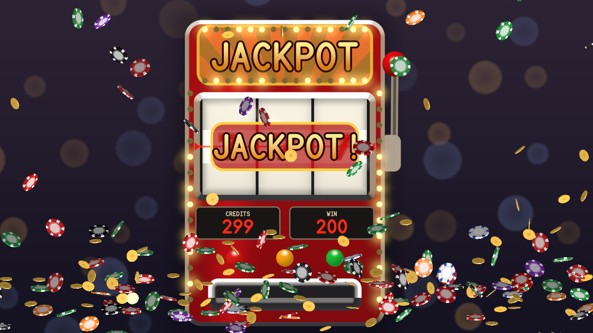
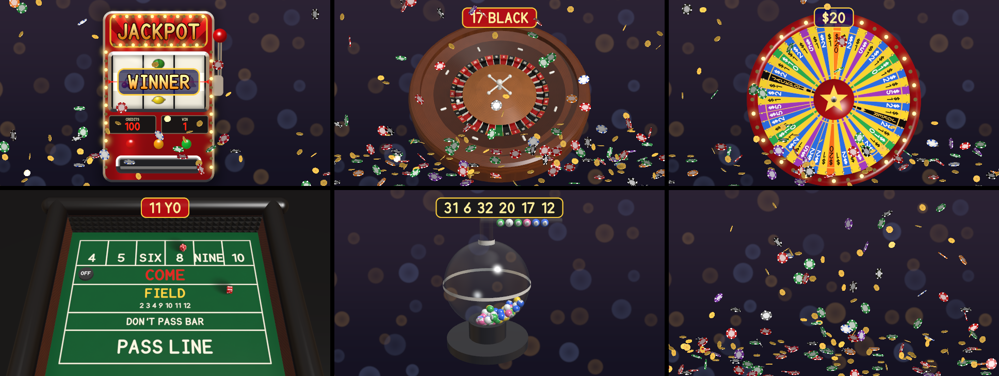

# jackpot

> **AI-assisted project.** This codebase was created with [Claude](https://claude.com/claude-code)
> (Anthropic), directed and reviewed by a human author. It has been loaded into
> **Resolume Arena 7.27.1 on macOS** and played there, and passed the fleet's Arena gate on
> Windows (see [Status](#status)); everything
> else below is measured by an offline harness that drives the real plugin classes in
> a headless GL context. `jptest --roulette` spins for
> every number of both wheels, and at rest the ball lies in the pocket painted
> with the number asked for, read from the ball and the ring **as drawn**; turning
> the rotor by any whole number of pockets leaves the ball's path **bit-identical**,
> and the ball leaves the track within 0.5% of v² = g r tan α.
> `--roulette-readback`, `--wheel-readback` and `--slots-readback` then read the
> result **out of the rendered pixels**. `--duration` brings every game to rest at
> exactly Spin Time, still moving a frame before. `jptest --negative` re-runs the
> checks against 21 deliberately wrong models and `tools/mutate.sh` changes one
> character of the shipped shaders and C++ ten times; every one is caught. A
> control sweep fails if any parameter does nothing.

The casino floor for Resolume Arena/Avenue, as two FFGL plugins: **SW Jackpot**, a
source, and **SW Jackpot Over**, the same over your clip. A one-armed bandit, a
roulette wheel, the money wheel, a craps table and the lottery drum — and chips and
coins showering on a win. Press **Play**; the game plays out with real physics and
comes to rest on a random result — or the one you set — at exactly **Spin Time**,
or on the next beat or bar.

Three sevens on the line: the banner, the meters counting the 200 credits in,
and the shower a jackpot sets off. Rendered by the plugin's offline harness
(`jptest`), not captured from Resolume.

<!-- downloads:start -->

## Download

**[v0.1.0](https://github.com/stoatworks-labs/jackpot/releases/tag/v0.1.0)** — prebuilt for macOS and Windows. Pick your platform:

<b>macOS</b> — Universal (Apple Silicon + Intel)

| Build | Download | Size |
| --- | --- | --- |
| Universal (Apple Silicon + Intel) · .dmg disk image | [`jackpot-0.1.0-macos-universal.dmg`](https://github.com/stoatworks-labs/jackpot/releases/download/v0.1.0/jackpot-0.1.0-macos-universal.dmg) | 1.4 MB |
| Universal (Apple Silicon + Intel) · .zip archive | [`jackpot-macos-universal.zip`](https://github.com/stoatworks-labs/jackpot/releases/latest/download/jackpot-macos-universal.zip) | 1.3 MB |

<b>Windows</b> — x64

| Build | Download | Size |
| --- | --- | --- |
| x64 · .exe installer | [`jackpot-0.1.0-windows-x86_64-setup.exe`](https://github.com/stoatworks-labs/jackpot/releases/download/v0.1.0/jackpot-0.1.0-windows-x86_64-setup.exe) | 417 KB |
| x64 · .zip archive | [`jackpot-windows-x86_64.zip`](https://github.com/stoatworks-labs/jackpot/releases/latest/download/jackpot-windows-x86_64.zip) | 669 KB |

All builds, checksums and release notes: [github.com/stoatworks-labs/jackpot/releases](https://github.com/stoatworks-labs/jackpot/releases).

macOS builds are signed and notarised and open normally. The Windows builds are unsigned, so SmartScreen warns once.

<!-- downloads:end -->

## The one idea

**Every casino game is decided before it is shown, and every one has a symmetry
the physics cannot see.** So each game is simulated honestly, ahead of time, and
then the paint is turned so the result is the one asked for:

| game | what decides it | what the physics cannot see |
| --- | --- | --- |
| Slots | the random number at the pull — true of every machine since Telnaes's virtual reel (US 4,448,419, 1984); the reels are a display | nothing needed: the stops ARE the result, and the reels are driven to them |
| Roulette | the ball, in a real wheel | the rotor's 37 (or 38) frets are identical: turn the numbered ring by whole pockets |
| Money wheel | the clapper on the pegs | 54 identical pegs: turn the painted segments by whole segments |
| Craps | two dice off the pyramids | each die's rotation group (polyhedral's engine): draw it as R(t)·S |
| Lottery | the air in the drum | identical balls: deal the numbers out to them |

The motion you see is exactly what the physics produced; only which number is
painted where has moved. The turn is never seen happening: on roulette the
croupier's hand spins the rotor up before the ball is released and takes the ring
there on the way; on the money wheel it is the pull before it is let go; in the
lottery the drum is empty between draws and the new balls drop in already painted.
Random results come from an integer generator weighted as the real game is, Fixed
ones from you, and both go through the same mechanism.

What falls out of it:

- **Near misses, honestly.** A Random pull on the *Virtual* strip draws each reel's
  stop on 64 virtual stops over 22 physical ones, the blanks beside the seven worth
  six each and the seven one. The seven sails past just above or below the line
  twelve times for every time it lands, against twice on a fair strip — because
  that is how the machines are built. *Near Miss* asks for one outright.
- **Motion blur from the shutter**, not a filter: each reel's strip is integrated
  over the frame's exposure, so at speed the symbols smear into streaks and
  sharpen as the reel brakes into its detent, which bounces as a damped spring.
- **The roulette ball leaves the track when it must**: held against the lip only
  while v² ≥ g r tan 14°, then down the stator, off a diamond if it meets one,
  across the frets of the counter-turning rotor, and into a pocket.
- **The money wheel's slowdown is the clapper**: every peg bends the leather and
  takes about 1.4 J, so the wheel ticks slower and slower and may rock back off
  the last peg.
- **Craps that knows the game**: come-out, point, the puck ON and OFF,
  seven-out; Win, Lose, Jackpot (11 on the come-out, the point made the hard way)
  and Near Miss read against the point the table is on.
- **The lottery as an air-mix machine**: a jet carries the balls up the middle and
  they fall back down the glass; when the tube opens, the first ball under the
  mouth goes up it and rolls along the rack.
- **Chips and coins as rigid discs**: tumbling in the air, bouncing, rolling on
  edge and, as they lean over, whirring faster and faster like Euler's disk
  before they slap flat into the pile.

Every game at rest on its result, with the result board above it. Rendered by
`jptest`.

## Results

Result reads against **the player's bet**, which is Fixed Number:

| | Slots | Roulette | Money wheel | Craps | Lottery |
| --- | --- | --- | --- | --- | --- |
| Random | weighted as the strip | each pocket 1 in 37 (38) | each segment 1 in 54 | each die 1 in 6 | each ball alike |
| Win | any paying line but the jackpot | the bet's number | the bet's value | a winning roll for the point | the bet drawn |
| Jackpot | sevens across | the bet's number | joker or logo | 11 on the come-out; the point made (the hard way on 4, 6, 8, 10) | the bet drawn last |
| Near Miss | two sevens, the third beside the line | a pocket beside the bet | beside the joker or logo | 6 or 8 on the come-out; one off the point | the number beside the bet |
| Lose | nothing paid, no near miss | anything but the bet | anything but the bet or the top | craps, or seven-out | the bet not drawn |
| Fixed | Fixed Number is the symbol (0 blank … 10 seven, 11 diamond) | the number (37 is 00) | the value | the total | the bet drawn first |

The slot machine pays from the left: three or more of a symbol (seven 200, diamond
100, triple bar 60, double bar 40, bar 20, bell 18, melon 15, plum 14, orange and
cherry 10, lemon 8; four in a row ×4, five ×20), mixed bars 10, a cherry on the
first reel 2 and two cherries 5. A pull costs a credit; the meter starts at 100.

## Controls

- **Game:** Game (*Slots*, *Roulette*, *Money Wheel*, *Craps*, *Lottery*, *Shower
  Only*), **Play**, Spin Time (1–20 s), Land On (*Time*, *Beat*, *Bar* — the first
  boundary at least Spin Time away), Result, Fixed Number, Seed, Auto Play and
  Interval (2–120 s).
- **Slots:** Reels (*3*, *5*), Symbols (*Fruit*, *Sevens and Bars*, and on the
  effect *Clip*: the clip where the seven would be), Strip (*Virtual*,
  *Physical*), Blur (the shutter), Reel Bounce.
- **Roulette:** Wheel (*European*, *American*), Rotor Speed, Deflectors.
- **Money wheel:** Clapper (the leather's stiffness).
- **Craps:** Pyramids (the back wall's rubber), Puck.
- **Lottery:** Balls (10–75), Draw (1–7), Air.
- **Shower:** Shower (*Off*, *On Win*, *On Jackpot*, *Always*), **Shower Now**,
  Pattern (*Rain*, *Fountain*, *Burst*, *Pour*), Pieces (*Chips*, *Coins*,
  *Mixed*), Amount, Piece Size, Pile.
- **Look:** Backdrop (*None* — transparent on the source, the clip on the effect —
  *Felt*, *Dark*), Felt Colour, Accent Colour, Lights, Display (the slot
  machine's banner and the other games' result board), Font, Font File, Font
  Name, Light Angle, Tilt (20° to straight down; the lottery is seen 35° lower),
  Zoom.
- **Over only:** Mix.

**Fonts travel by name**, as in polyhedral: the dropdown stores an index into
*this* machine's list, Font Name keeps the family, and the name wins when a
composition restores both.

## Status

**v0.1.0, 2026-10-09, and honestly early.** User guide:
[stoatworks-labs.com/software/jackpot/guide](https://stoatworks-labs.com/software/jackpot/guide/).

**In Resolume Arena 7.27.1 on macOS** (this Mac, Apple M4 Max, 2026-10-09): Arena's log
registers `'SW Jackpot' uid: JP01 category: 3` and `'SW Jackpot Over' uid: JP02
category: 1`, each loading in under half a second. SW Jackpot dropped into a clip
showed the slot machine at 1920×1080 with every control group; Result *Jackpot* and
Play landed three sevens at Spin Time with the banner, the meters counting 200 in and
the shower raining; switched to Roulette, the ball ran the track and came to rest on
7 RED, the bet's number, under the result board. The plugin's own log recorded both
plays as asked and no warning or error. The Over effect, the other three games, Land
On against Arena's transport and a saved composition were not tried there. `oxbow
probe` reads the bundles as a host does and `oxbow selftest` renders through each. No
OpenFX port, no browser demo.

**In Resolume Arena 7.27.1 on Windows** (win-lab, Mesa llvmpipe, no GPU,
2026-10-09): a CI build of this source loads from Extra Effects, `SW Jackpot`
registers as `JP01`, a source, and `SW Jackpot Over` as `JP02`, an effect; all 50
and 52 host controls match the declaration in name, order, type, range and default
(the two names at Resolume's 16-character limit complete); both render, with a font
loaded from file, and Arena's log stays clean through the run: **17 passed, 0 failed**
of the fleet gate's checks. The gate never presses Play, so it can only show the
controls that change an idle picture: 25 on the source and 27 on the effect did,
none read dead, and Font File alone was inconclusive. The 16 that act only on a play
(Spin Time, Land On, Result, Fixed Number, Seed, Strip, Blur, Reel Bounce, Rotor
Speed, Clapper, the lottery's Balls, Draw and Air, Display, Auto Play and Interval)
were not measured there. Software rendering says nothing about a GPU or about speed.

What is measured, on this machine:

| | |
| --- | --- |
| slots | every Result on 3 and 5 reels, both symbol sets, 1,632 pulls: every reel at rest **exactly** on its drawn stop, the reels stopping left to right with the last at Spin Time; the pay table against eight lines worked by hand from this README |
| near miss | 400,000 pulls a strip, reel 3: the seven on the line 0.01534 (table 1/64 = 0.01562), the blanks beside it 0.18848 (12/64 = 0.18750); Physical 0.04520 and 0.09168 (1/22, 2/22). **12.3** near misses per jackpot seven on the virtual reel, **2.0** on a fair strip |
| blur | at 0.70 stops a frame, the reels are **0.007–0.011** (mean per channel) from the strip integrated over the shutter and 0.158 from the instant; at rest 0.034–0.055 from the sharp strip; 320×180 and 640×360 |
| slots readback | **192** payline symbols read out of the picture against the symbol atlas, 0 wrong, 320×180 and 640×360 (the closest call 1.3× on the pixels where two symbols differ) |
| roulette | every number of both wheels, Fixed: the ball at rest in the pocket painted with it, 75 of 75; the rotor turned 1, 5, 18 and 36 pockets, the ball's path **bit-identical**; ten releases leave the lip within **0.47%** of v² = g r tan 14°; Random chi-square 41.6 and 33.3 (critical 68.1, 69.4); the ball's top never above 73.4 mm, the lip drawn to 80 |
| roulette readback | the number painted under the ball and beside it, **40 of 40** read from the picture, both wheels, two rasters |
| money wheel | every value, Fixed, 35 spins over 18 segments; the wheel turned 1, 7, 27 and 53 segments, the pegs and the clapper **bit-identical**; every one of 114 peg passages took energy, the median 1.46 J against the bearing's 0.058 J a segment; Random chi-square 65.1 over the segments (critical 90.6), 8.0 over the values (22.7); 14 of 14 read from the picture |
| craps | every total 2–12, 44 throws: the faces on top of the dice **as drawn** add up to it; every throw reached the back wall, every die flat on the felt, none inside the other; the pass line through a scripted shooter; Win and Lose against every point, 84 of 84 |
| lottery | 16 draws of 10 to 75 balls: the rack, left to right, shows the numbers drawn; the paint a permutation every time; every drawn ball rises up the tube; balls never overlap more than 1.75 mm (bound 3) nor leave the glass; Random chi-square 41.3 (critical 84.1) |
| shower | a coin falling face on for 1.5 s within 0.009 of the closed form under quadratic drag (bound 0.019, g T dt); a tumbling chip keeps its angular momentum to 0.48% while its axis wobbles; 1.1 million contact steps, none added energy; 277 pieces at rest, all flat; **Euler's disk**: the contact's rate within 6% of Ω² = 4 g / (r sin α) from 7° to 1.3° of lean, rising 2.5× |
| duration | every game, Spin Time 3, 6 and 12 s: at rest at Spin Time, moving a frame before, still after; Land On, 64 waits each ending on a beat or bar boundary |
| Over | the clip (premultiplied, alpha and all) untouched where there is no game and everywhere at Mix 0, to 1.2×10⁻⁷ |
| the rest | defaults, names (unique as Arena addresses them, no '/'), determinism (the same seed is the same play to the bit), resize mid-shower, fonts by name, missing and by file, credits and the craps point carried between plays, the roulette ring never jumping at a Play, and a slot pull mid-spin carrying the reels on from where they are |
| tables | the dice's face loops, groups and labels identical from arm64 with fused multiply-adds, arm64 without, and x86_64 (polyhedral's check) |
| negative controls | **21** deliberately wrong models, **all 21** detected |
| mutants | **10** one-character changes (three GLSL, seven C++), **all 10** caught |
| dead controls | **46** parameters over both plugins, all live |

Render cost (`jptest --bench`, mid-play, the median frame on an Apple M4 Max on a
machine shared with other builds, the range over two runs), 720p / 1080p / 4K:
slots **0.5 / 0.8 / 1.7–1.8 ms**; roulette **2.0–2.2 / 4.1–4.2 / 5.3–5.4**; money
wheel **0.3 / 0.7 / 1.4**; craps **1.2–1.3 / 2.2–2.3 / 2.5–2.6**; lottery, 49 balls,
**0.6–0.7 / 1.2–1.5 / 3.4**; a constant shower **1.0 / 1.2 / 2.3**. Up to 1080p every 3D pixel takes four rays; above it only the pixels on an
edge do. A play is planned on a worker, so it starts a frame or two after the
press: craps **1 ms**, roulette **13**, the lottery **47** (49 balls), the money
wheel **55** (worst 82).

What is **not** verified, and is the honest limit of this release:

- **Two plays in one Arena on a Mac, and a gate on Windows that never presses Play.**
  No play has run on Windows. Nothing here has met Arena's transport (whether
  `barPhase` is a usable downbeat is unmeasured fleet-wide; Land On trusts it), its
  parameter restore order across a saved composition, or any GPU but this one.
- **The physics is mine, and checked, not fitted.** The roulette ball is a point
  carrying its radius on a profile of cones, with one friction for each surface;
  the clapper is a spring that straightens at a third of its stiffness; the
  lottery's air is a jet, a trace of swirl and some turbulence; the chips are
  single-point contacts. Each is checked against the law it should obey (the
  departure, the energy, Euler's disk), not against filmed casino equipment. The
  constants were chosen to look right.
- **Roulette's frets are flush with the pockets' rims** and stop at the steps'
  feet. Standing proud of the apron, a fret's end once held the ball for ever.
- **Craps throws are a stickman's ordinary ones** (1.9–2.5 m/s) and settle in under
  a second. A longer Spin Time is met by the shooter's hold after the sweep and at
  most a 0.6× slow motion — never by throwing harder.
- **Short Spin Times are played fast.** The lottery takes 2 s just to load 49 balls,
  so a 3 s draw plays at about 3×; a 3 s money-wheel spin at up to 1.6×.
- **The slot machine and the money wheel are drawn face on in 2D**; roulette,
  craps and the lottery are ray-traced 3D. Light Angle and Tilt act on those three
  and the shower only.
- **A piece settling into the pile is turned flat**, by up to 11° (the gate is
  16°); the pile is a height field, not a stack of bodies.
- **Above 1080p, edges the 2×2 pixel quads cannot see are single-sampled**: an
  edge between two quads is one ray, not four.

## Build

C++17 + GLSL 4.10, CMake, FFGL 2.1 (SDK vendored as a submodule). macOS builds
are universal (arm64 + x86_64); Windows needs GLEW via vcpkg.

    git clone --recursive https://github.com/stoatworks-labs/jackpot
    cmake -B build -DCMAKE_BUILD_TYPE=Release
    cmake --build build
    cmake --install build          # both bundles into Resolume's Extra Effects

## Building and testing

The offline harness renders the real plugin classes headlessly, planning each
play on the render thread so every run is the same run:

    ./build/jptest --out /tmp/jackpot.png                      one play to rest
    ./build/jptest --over --out /tmp/over.png                  the effect, on a card
    ./build/jptest --set "Game=Roulette" --set "Result=Fixed" --set "Fixed Number=17"
    ./build/jptest --slots            every Result, reels on their stops, the pay table
    ./build/jptest --nearmiss         the virtual reel against its table
    ./build/jptest --blur             the strip integrated over the shutter
    ./build/jptest --slots-readback   the payline read out of the pixels
    ./build/jptest --roulette         every pocket, C37, the departure, Random
    ./build/jptest --roulette-readback  the number under the ball, from the pixels
    ./build/jptest --wheel            every value, C54, the clapper, Random
    ./build/jptest --wheel-readback   the segment under the clapper, from the pixels
    ./build/jptest --craps            every total, the throw, the pass line
    ./build/jptest --lottery          the rack, the permutation, the drum
    ./build/jptest --shower           flight, energy, the pile, Euler's disk
    ./build/jptest --duration         every game at rest at Spin Time
    ./build/jptest --defaults --names --determinism --over-check --resize --fonts --state
    ./build/jptest --negative         every check above against a wrong model
    ./build/jptest --offline          the no-GL subset and its negative controls (what CI runs)
    ./build/jptest --shaders --out DIR  every program, written out and through this Mac's driver
    tools/mutate.sh                   one character changed, a check must fail
    python3 tools/sweep.py            no control is silently dead
    ./build/jptest --bench            720p through 4K, and the planners' cost
    tools/verify.sh                   all of it, in about three minutes

`--set` takes an option by its name or its index, and refuses a value that is
neither. Filming uses the fleet's frame format and cue sheets (a press of Play is
three cues, 0 1 0, or `--play N`):

    ./build/jptest --film 600 --size 1280x720 --play 10 --set "Game=Roulette" \
      | ffmpeg -f rawvideo -pix_fmt rgba -s 1280x720 -r 60 -i - roulette.mp4

<!-- attributions:start -->
This project is built on other people's work — see [ATTRIBUTIONS.md](ATTRIBUTIONS.md).
<!-- attributions:end -->

## Licence

MIT.

The craps dice are polyhedral's engine; the virtual reel is Telnaes's; the contact
solvers are sequential impulses (Catto); the unbiased draws are Lemire's; the
ray–primitive intersections follow Quilez; the glyph distance fields are
stb_truetype's. Nothing is copied from anyone's source but the vendored headers
in `external/`.
